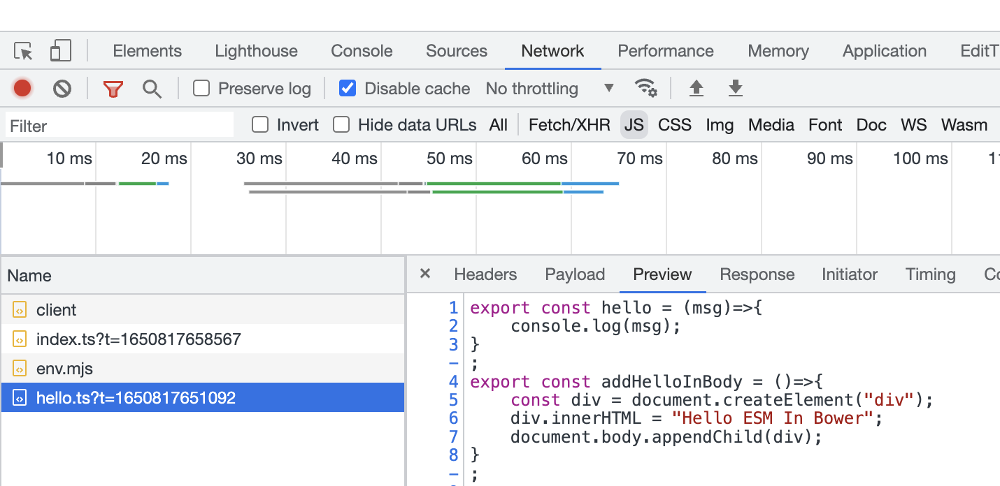
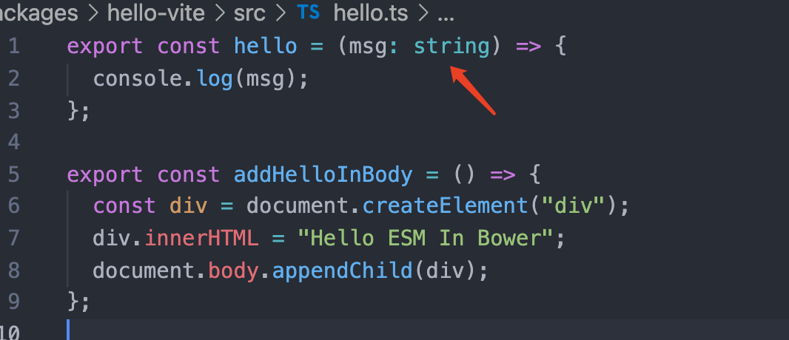

# Vite的优势

一个字【快】

## Vite基本原理

- Vite将代码区分为`源码` 与`依赖`

- 依赖：node_modules 中的三方包

  - esbuild构建依赖，比使用NodeJS制作的编译器快上数倍

- 源码：工程代码包含（JS/JSX/CSS/Vue等，Vite会将其编译）

  - 使用ESM方式提供源码给浏览器，让浏览器取代了部分打包工作（现代浏览器可以理解ESM模块文件）
  - 根据依赖按需加载文件

  

## 什么是ESM方式提供源码给浏览器 ？

浏览器通过 ESM 的方式加载JS文件，类似我们本地使用ES6 的 ESM 方式开发 Webpack 等打包工具均可以理解我们的意图，浏览器现在也可以直接理解 ESM 规范的JS文件了，同时支持同步ESM模块和异步ESM模块。详细请看：[在浏览器中使用 ECMAScript Modules](https://juejin.cn/post/6943233321765715976)，这位大佬已经写的很好了

学以致用：[vite-demos/hello-esm](https://github.com/swdenglian/vite-demos/tree/master/packages/hello-esm)

## Hello Vite

代码示例：[vite-demos/hello-vite](https://github.com/swdenglian/vite-demos/tree/master/packages/hello-vite)

根据浏览器加载ESM原理，可以猜测Vite也是启动了一个特殊的本地资源服务器，Vite比`hello-esm`中的实例使用hettp-server应该多了一层.ts=>转化为.js文件的过程。通过浏览器调试工具(如下图)加上[官网的说明](https://cn.vitejs.dev/guide/#index-html-and-project-root)可以初步的佐证猜想，Vite内部肯定不可能是猜想这么简单，但是对于目前理解Vite够用了。

